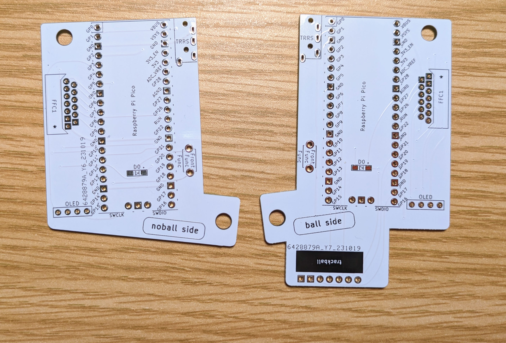
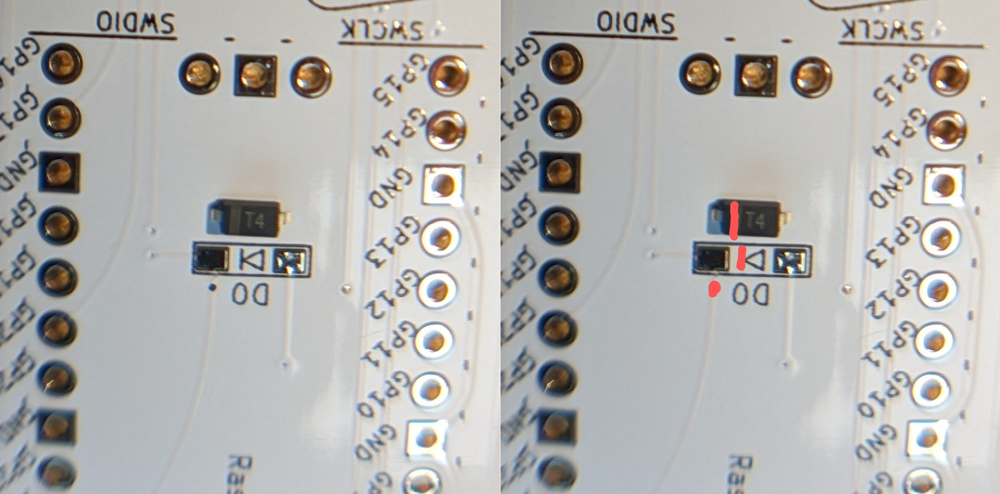
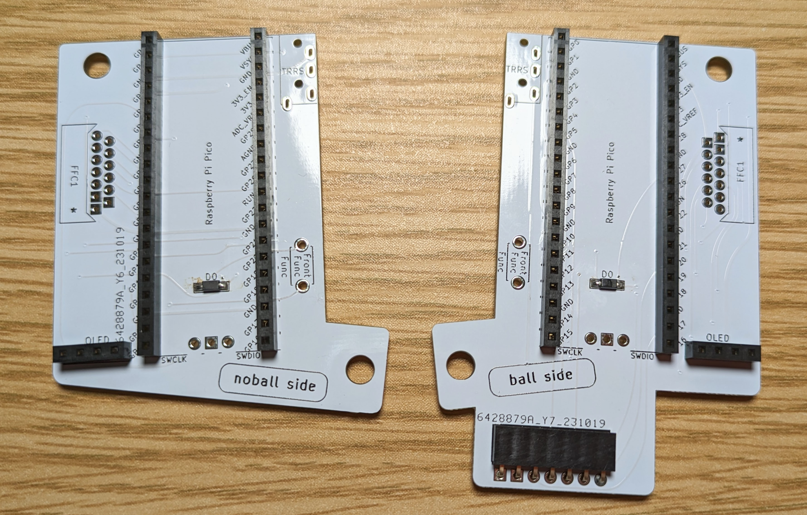
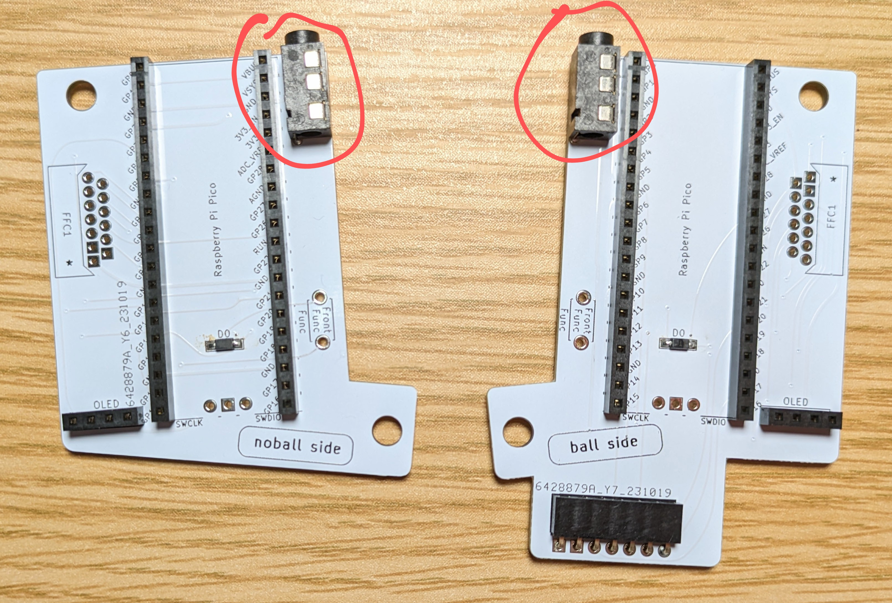
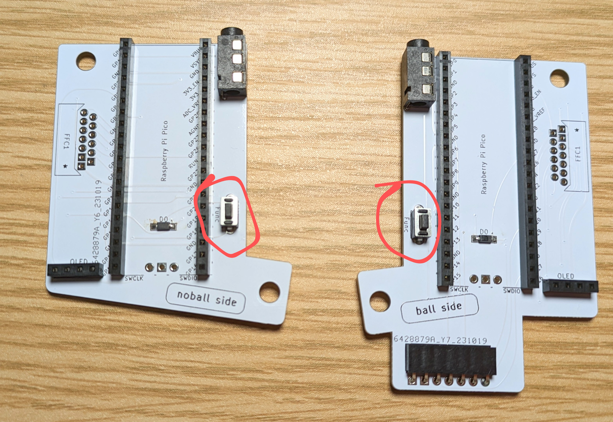
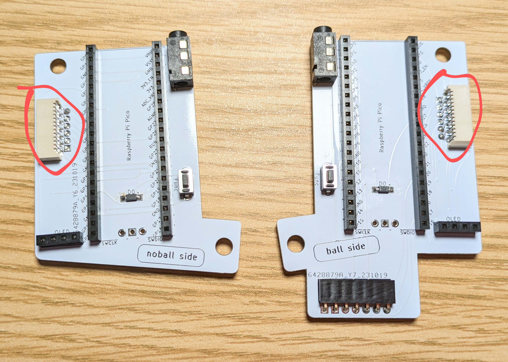
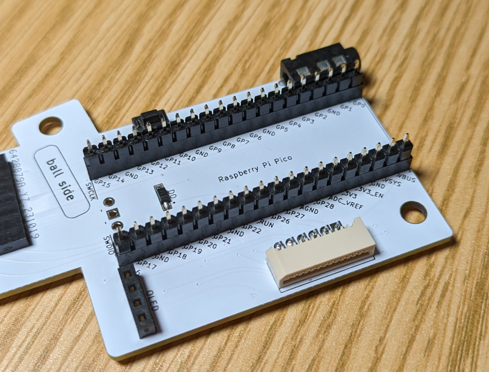
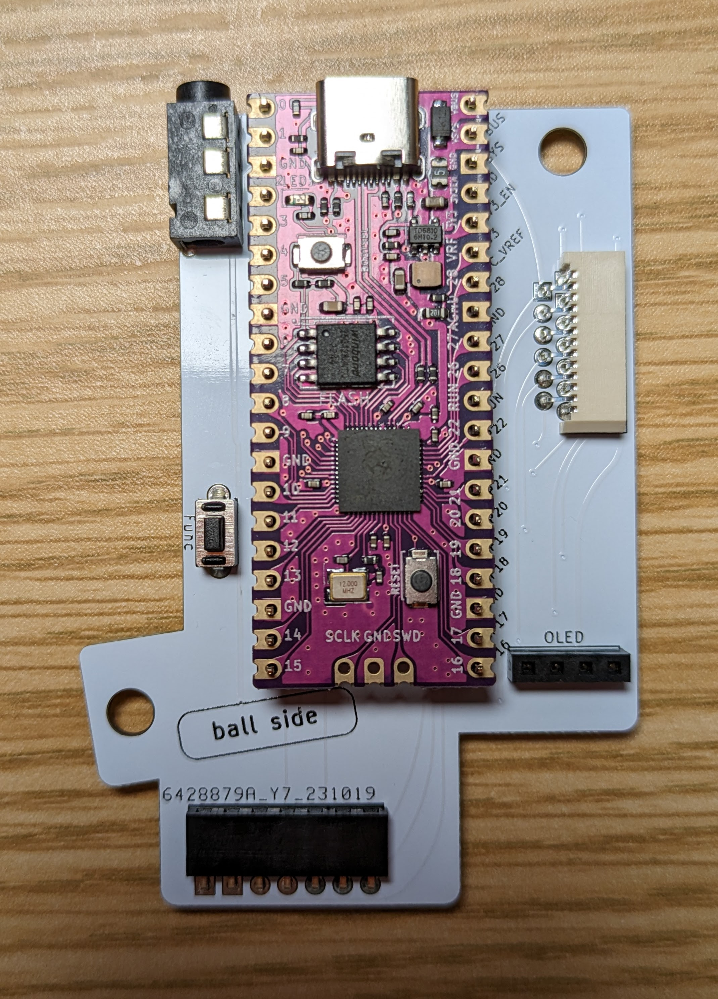
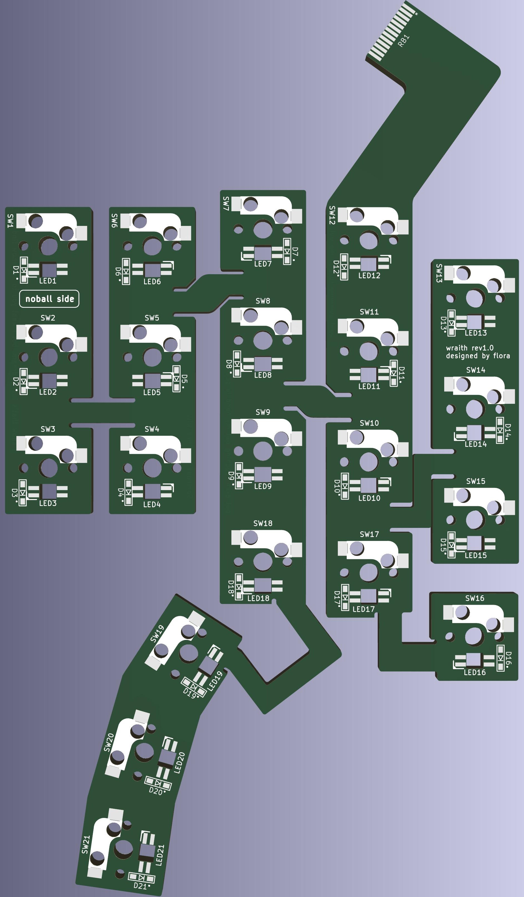
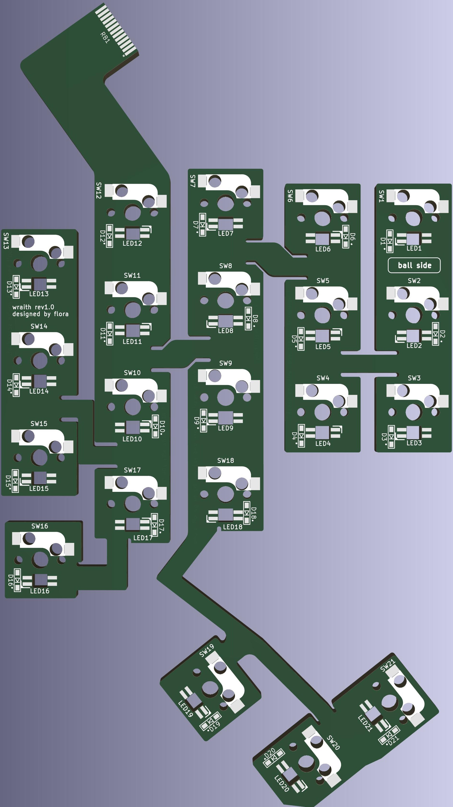

# Build Guide for Wraith

## 部品確認
　最初にすべての部品が揃っているかを確認してください。なお文字だけでわかりにくい部品は[部品の詳細](##部品の詳細)を参照のこと。
### キット同梱品
| パーツ名 | 数 |備考|
| ---- | ---- |---- |
| メインPCB（ball side） | 1 | |
| メインPCB（noball side） | 1 | |
| flexible PCB（ball side） | 1 | |
| flexible PCB（noball side） | 1 | |
| トラックボール用PCB | 1 | 部品実装済み|
| ダイオード（表面実装） | 44以上 |22+22|
| ピンヘッダ(20pin) | 4 ||
| ピンソケット(20pin) | 4 ||
| ピンヘッダ(7pin) | 1|| 
| L字ピンソケット(7pin) | 1 |L字タイプ|
| ピンヘッダ(4pin) | 2 ||
| ピンソケット(4pin) | 2 ||
| TRRSジャック | 2 ||
| タクタイルスイッチ | 2 ||
| フラットケーブル用コネクタ | 2 ||

### 自分で用意する部品
| パーツ名 | 数 |備考|
| ---- | ---- |---- |
| 3Dプリントモデル（ball side） | 1 | |
| 3Dプリントモデル（noball side） | 1 | |
| Raspberry Pi Pico | 2 | |
| YS-SK6812MINI-E（オプション） | 42 | 21+21|

## メインPCBの実装
　ball sideとnoball sideのメインPCBにパーツを実装していきます。

パーツの実装はball side, noball sideというシルク印刷がある面（上記画像の面）に行います。裏表は間違えないように注意してください。
### ダイオードの実装
　メインPCBには1箇所ずつダイオードを実装する場所があります。ダイオードには向きがあるので向きを間違えないように注意して実装してください。

　画像のように、ダイオードに印刷された縦線とシルク印刷の縦線が同じ向きになるように印刷してください。また実装後でも向きがわかるように、線側のパッドにはドットも印刷されています。

### ピンソケットの実装
　ピンソケットはRaspberry Pi Pico用の20pinが4箇所、OLEDモジュール用の4pinが2箇所、トラックボール用PCBとの接続用のL字ソケットがball sideのみに1箇所あり、合計7箇所あります。これらをはんだ付けしていきます。ピンソケットとピンヘッダを使用することでパーツの故障時に交換が楽になります。

画像のように合計7箇所にピンソケットを差し込み、裏からはんだ付けを行います。はんだ付けを行う前に裏表が間違っていないか今一度確認してください。
 
はんだ付けの際には両端の2pinをはんだ付けして浮いていたり傾いたりしていないかを確認し、問題なければすべてのpinをはんだ付けしてください。なお**ピンソケットのはんだ付けの際にはんだが多すぎるとピンソケットの穴がはんだで埋まってしまいピンヘッダが挿入できなくなることがあります。ピンソケットのはんだ付けの際ははんだを流し込みすぎないようにくれぐれも注意してください。**

### TRRS端子の実装
2箇所のTRRS端子をはんだ付けします。

### Tactile switchの実装
2箇所のTactile switchをはんだ付けします。向きはありません。なおこのスイッチはリセットではありません。

### フラットケーブル用コネクタの実装
flexible PCBと接続するためのフラットケーブルコネクタを実装します。

### Raspberry Pi Picoの実装
画像のように、20pinのピンソケットにピンヘッダを差し込みます。

次にRaspberry Pi Picoを乗せます。このとき向きに注意してください。**Raspberry Pi Picoの実装部品がある面が上**です。**Raspberry Pi PicoとメインPCBのシルク印刷の内容が一致する向き**になっていることを確認してください。

正しい向きに乗せたらはんだ付けします。
### OLEDモジュールの実装
工事中。

## flexible PCBの実装
うすく曲げることができるPCBをflexible PCBと言います。wraithではキースイッチ部分のPCBはflexible PCBを採用することによって、3次元的なキー配置を実現しています。なおflexible PCBはシルク印刷の精度が通常より悪く、読めないことがあるかもしれないので、綺麗な画像を[flexiblePCBのシルク印刷](##flexiblePCBのシルク印刷)に乗せてあります。
### ダイオードの実装
ダイオードはそれぞれのflexible PCBにそれぞれ21個あります。これらをすべて実装していきます。
### キーソケットの実装
### ダイオードの実装

## flexible PCBのシルク印刷 {#flexsilk}

