# Build Guide for Wraith

## 部品確認
　最初にすべての部品が揃っているかを確認してください。なお文字だけでわかりにくい部品は[部品の詳細](#部品の詳細)を参照のこと。
### キット同梱品
| パーツ名 | 数 |備考|
| ---- | ---- |---- |
| メインPCB（ball side） | 1 | |
| メインPCB（noball side） | 1 | |
| flexible PCB（ball side） | 1 | |
| flexible PCB（noball side） | 1 | |
| トラックボール用PCB | 1 | 部品実装済み|
| ダイオード（表面実装） | 44以上 |22+22|
| Kailh スイッチソケット | 42 |21+21|
| ピンヘッダ(20pin) | 4 ||
| ピンソケット(20pin) | 4 ||
| ピンヘッダ(7pin) | 1|| 
| L字ピンソケット(7pin) | 1 |L字タイプ|
| ピンヘッダ(4pin) | 2 ||
| ピンソケット(4pin) | 2 ||
| TRRSジャック | 2 ||
| タクタイルスイッチ | 2 ||
| フラットケーブル用コネクタ | 2 ||
| PMW3360(光学センサー) | 1 ||
| PMW3360用レンズ | 1 ||
| クッションテープ | 1 ||
| インサートナット(M4) |  ||
| ねじ(M4) |  ||

### 自分で用意する部品
| パーツ名 | 数 |備考|
| ---- | ---- |---- |
| 3Dプリントモデル（ball side） | 1 |[3Dモデルの入手方法](#3Dモデルの入手方法)参照 |
| 3Dプリントモデル（noball side） | 1 | [3Dモデルの入手方法](#3Dモデルの入手方法)参照|
| Raspberry Pi Pico | 2 | Wraithにはリセットスイッチがないので、リセットスイッチがついているものがおすすめです（必須ではない）。|
| CherryMX互換キースイッチ | 42 | 21+21|
| キーキャップ(1u) | 42 | 21+21|
| YS-SK6812MINI-E（オプション） | 42 | 21+21(自信がない場合余分に用意しましょう)|

### 道具類
| パーツ名 | 備考|
| ---- |---- |
| はんだごて | LEDを実装する場合には温度調整可能なものが望ましい |
| はんだ | LEDを実装する場合には低融点のものが望ましい|
| 瞬間接着剤 | |
| プラスドライバー | |
| ピンセット | |

## 3Dモデルの入手方法
工事中。

## メインPCBの実装
　ball sideとnoball sideのメインPCBにパーツを実装していきます。
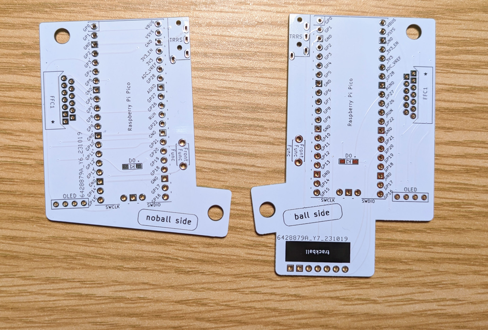
パーツの実装はball side, noball sideというシルク印刷がある面（上記画像の面）に行います。裏表は間違えないように注意してください。

### ダイオードの実装
　メインPCBには1箇所ずつダイオードを実装する場所があります。ダイオードには向きがあるので向きを間違えないように注意して実装してください。
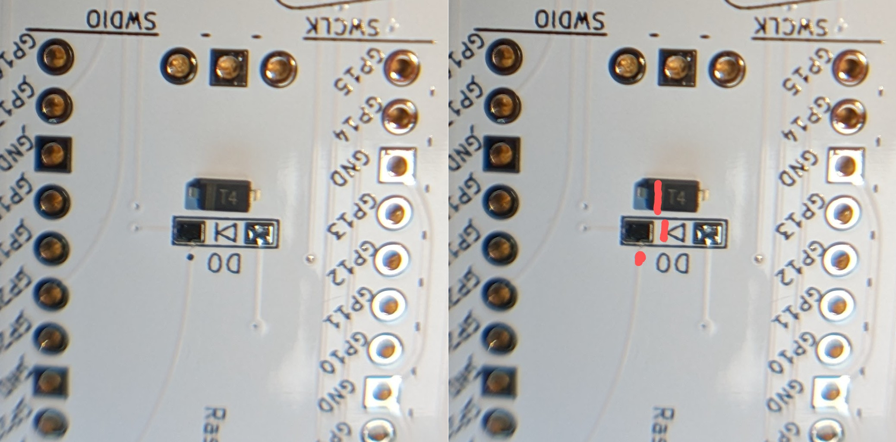
　画像のように、ダイオードに印刷された縦線とシルク印刷の縦線が同じ向きになるように印刷してください。また実装後でも向きがわかるように、線側のパッドにはドットも印刷されています。

### ピンソケットの実装
　ピンソケットはRaspberry Pi Pico用の20pinが4箇所、OLEDモジュール用の4pinが2箇所、トラックボール用PCBとの接続用のL字ソケットがball sideのみに1箇所あり、合計7箇所あります。これらをはんだ付けしていきます。ピンソケットとピンヘッダを使用することでパーツの故障時に交換が楽になります。
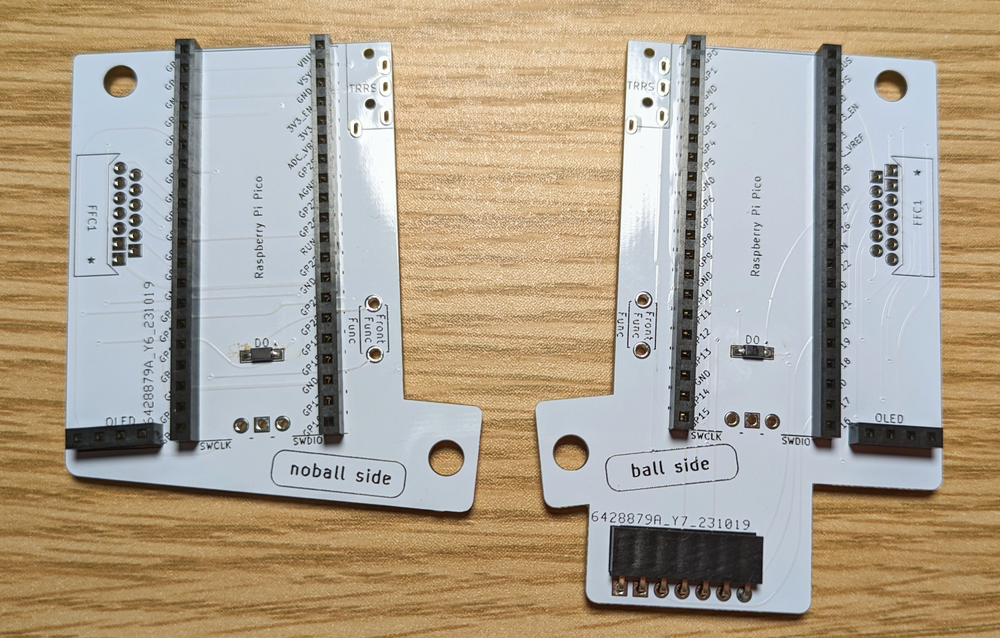
画像のように合計7箇所にピンソケットを差し込み、裏からはんだ付けを行います。はんだ付けを行う前に裏表が間違っていないか今一度確認してください。
 
はんだ付けの際には両端の2pinをはんだ付けして浮いていたり傾いたりしていないかを確認し、問題なければすべてのpinをはんだ付けしてください。なお**ピンソケットのはんだ付けの際にはんだが多すぎるとピンソケットの穴がはんだで埋まってしまいピンヘッダが挿入できなくなることがあります。ピンソケットにはんだが流れ込んでる感覚があったら、すぐに中断してください。**

### TRRS端子の実装
2箇所のTRRS端子をはんだ付けします。
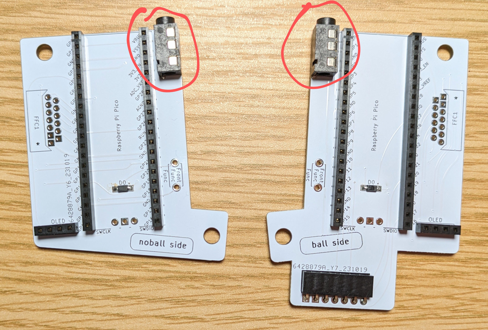

### Tactile switchの実装
2箇所のTactile switchをはんだ付けします。向きはありません。なおこのスイッチはリセットではありません。
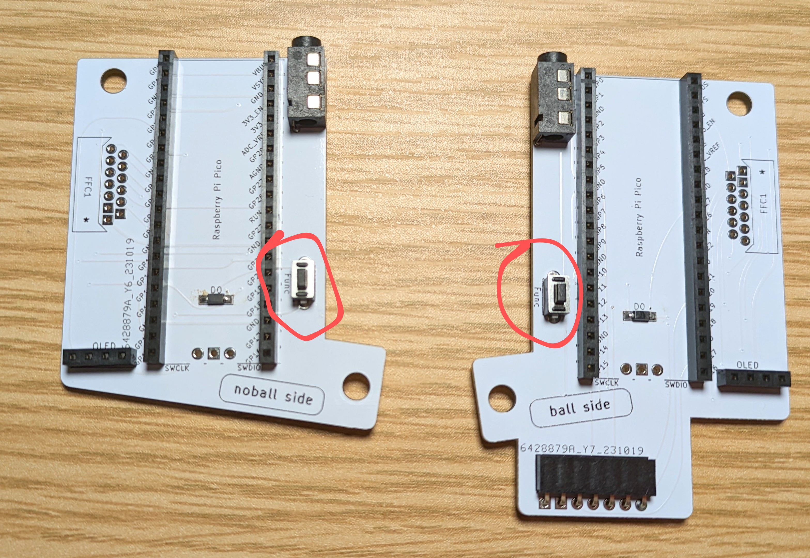

### フラットケーブル用コネクタの実装
flexible PCBと接続するためのフラットケーブルコネクタを実装します。
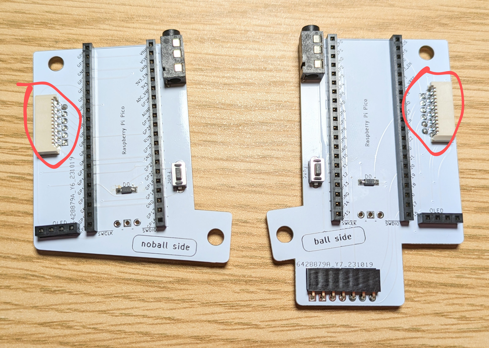
シルク印刷のポリゴンを隠すように配置して、裏面からはんだ付けをします。

### Raspberry Pi Picoの実装
画像のように、20pinのピンヘッダをピンソケットに差し込みます。向きはありません。
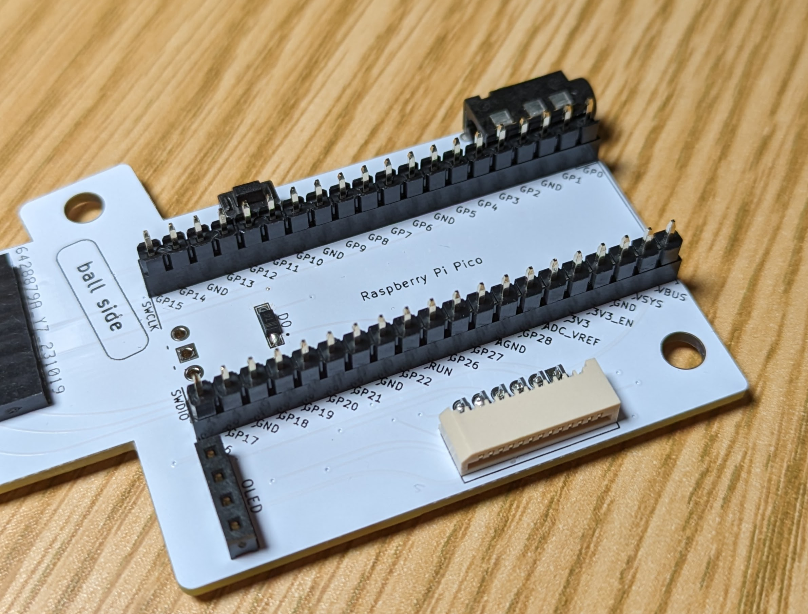
次にRaspberry Pi Picoを乗せます。このとき向きに注意してください。**Raspberry Pi Picoの実装部品がある面が上**です。**Raspberry Pi PicoとメインPCBのシルク印刷の内容が一致する向き**になっていることを確認してください。
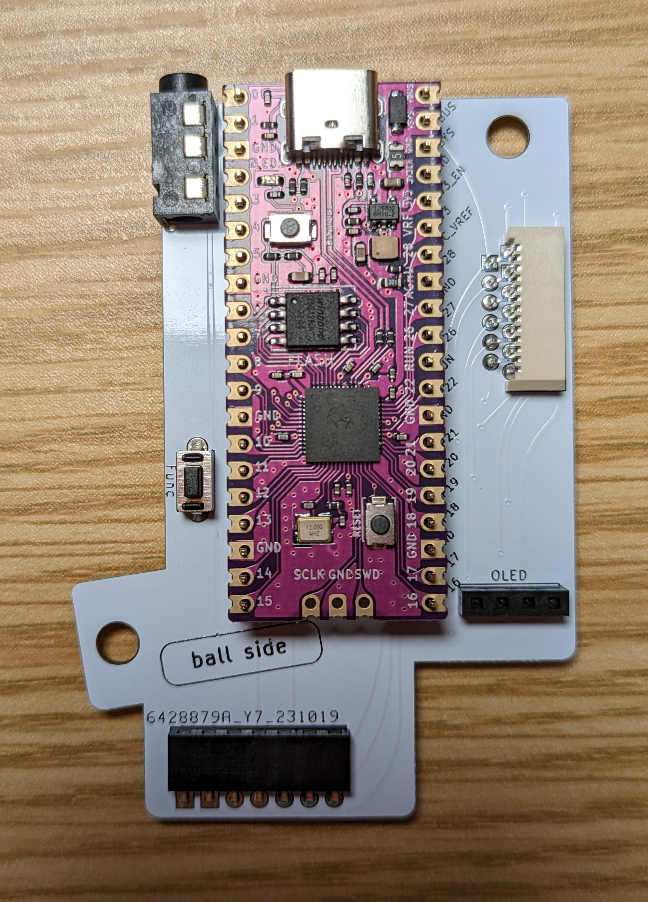
正しい向きに乗せたらはんだ付けします。
### OLEDモジュールの実装
適当なサイズにカットしたクッションテープをフラットケーブルコネクタの上に貼り付けます。
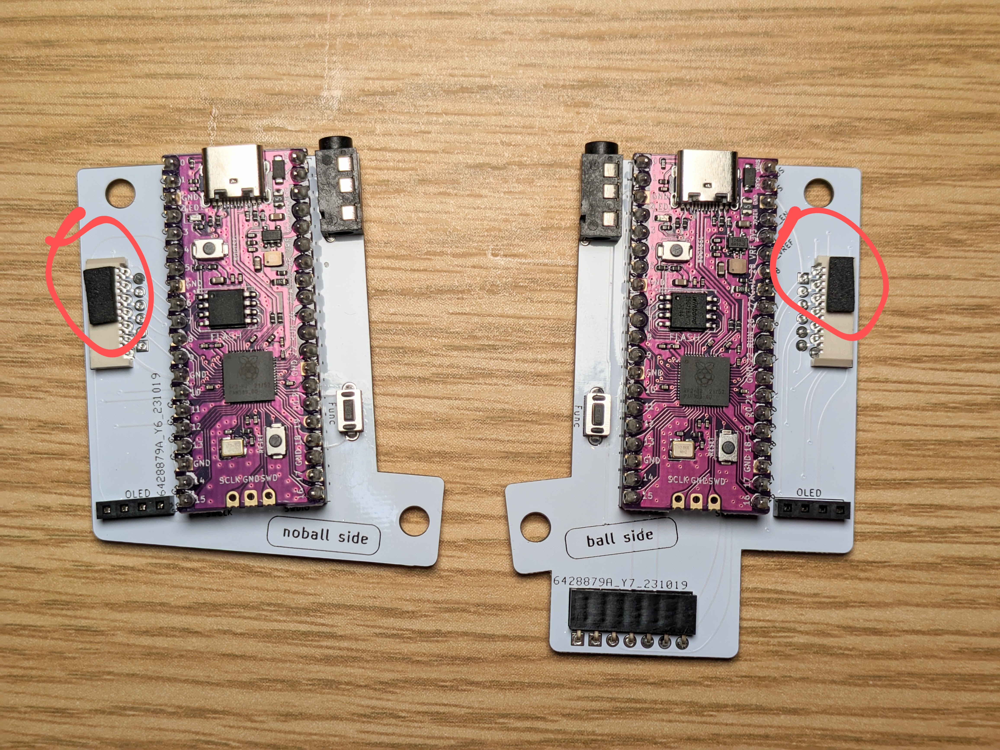
次に4pinのピンヘッダをピンソケットに差し込みます。
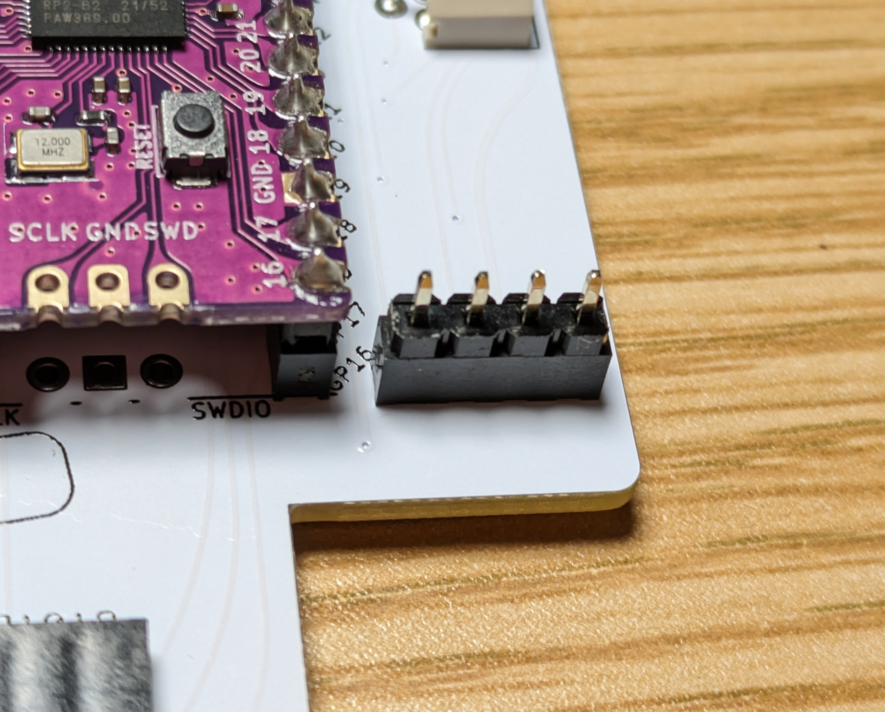
差し込んだピンヘッダにOLEDを乗せてはんだ付けします。このときOLEDが斜めっているとかっこわるいことになるので、1つのpinをはんだ付けしてから斜めになっていないことを確認し、そのあとすべてのpinをはんだ付けします。またはんだ付け時、ディスプレイにはんだが触れないように注意してください。
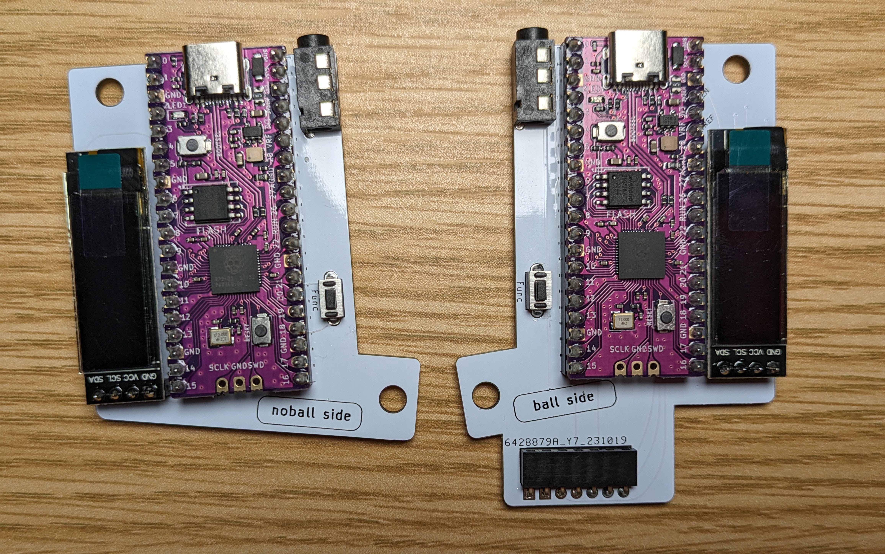
これでメインPCBの実装が終わりです。

## flexible PCBの実装
薄くて曲げることができるPCBをflexible PCBと言います。wraithではキースイッチ部分のPCBはflexible PCBを採用することによって、3次元的なキー配置を実現しています。なおflexible PCBはシルク印刷の精度が通常より悪く、読めないことがあるかもしれないので、綺麗な画像を[flexible PCBのシルク印刷](#flexible-PCBのシルク印刷)に乗せてあります。
### ダイオードの実装
ダイオードはそれぞれのflexible PCBに21個ずつあります。シルク印刷を参照しながらこれらをすべて実装していきます。ダイオードには向きがあります。[ダイオードの実装](#ダイオードの実装)を参照。

### LEDの実装(オプション)
YS-SK6812MINI-E(LED)を実装します。なお、LEDの実装はオプションなので、LEDが不要であればこのsubsectionはスキップしてください。
 
LEDには向きがあります。YS-SK6812MINI-Eの4つの足のうちひとつだけ切り欠きがある端子があり、それとシルク印刷の「のような記号を合わせます。以下の画像を参照。
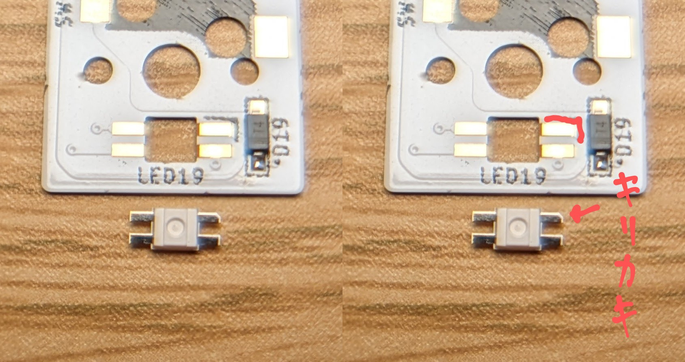
なおLEDは熱に弱いので、低温はんだを使ってはんだごての温度を230度くらいに調整してはんだ付けすることをおすすめします。またはんだ付けの際には4つの足を同時にはんだ付けしようとせず、1つの足をはんだ付けしたら次のLEDに移ることを繰り返し、同じLEDに熱を与えすぎないようにします。
 LEDのでっぱる厚さよりもflexible PCBのほうが薄いので平らなところに置いてLEDをはんだ付けしようとするとLEDが浮いてしまいます。画像のように適当な隙間を作ってそこではんだ付けするといいかもしれません。
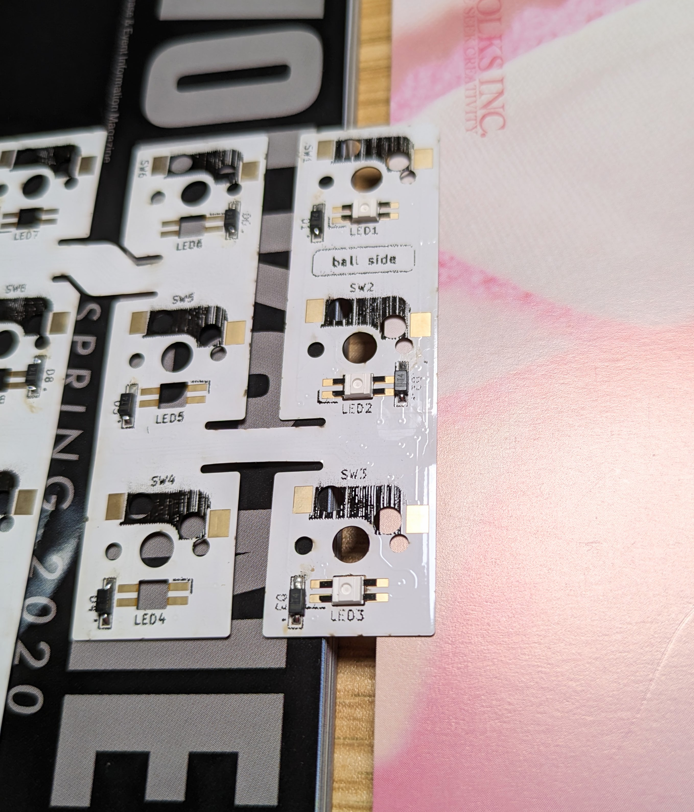

### Kailh スイッチソケットの実装
LEDのはんだ付けをした場合ははんだごての温度を戻します。 
Kailh スイッチソケットをはんだ付けします。スイッチソケットを使うことで、キースイッチの交換がはんだ付け不要で可能になります。
スイッチソケットには向きがあります、シルク印刷のベタの形状とスイッチソケットの形状が合うように配置してはんだ付けしてください。

スイッチソケットのでっぱる厚さよりもflexible PCBのほうが薄いので平らなところに置いてスイッチをケットをはんだ付けしようとするとスイッチソケットが浮いてしまいます。画像のように適当な隙間を作ってそこではんだ付けするといいかもしれません。
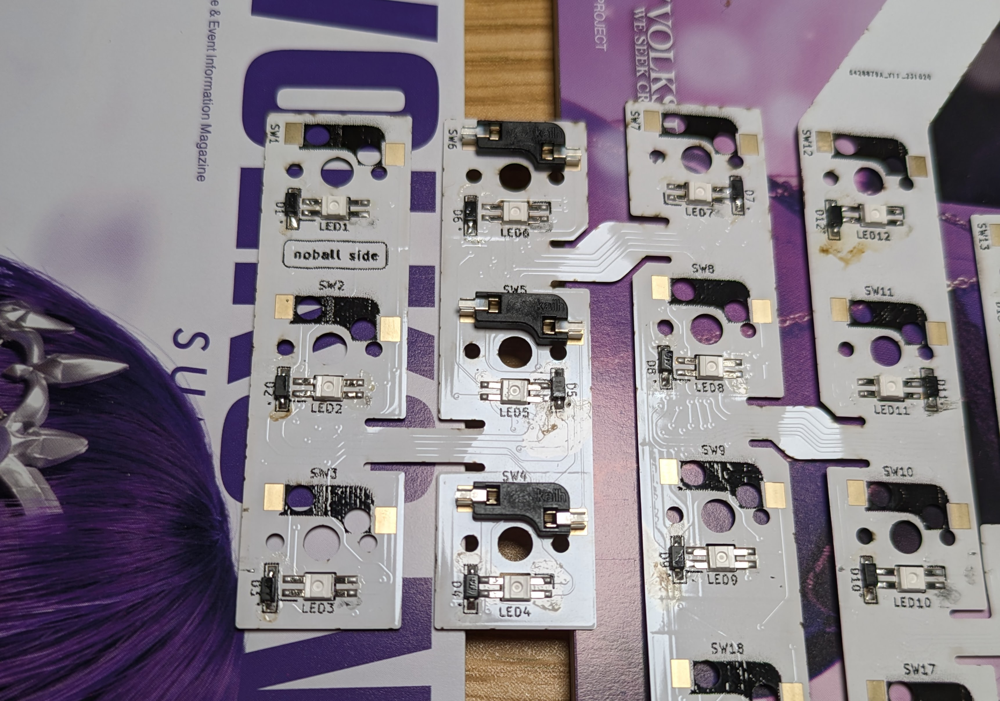

ダイオード、スイッチソケット、LED（オプション）のはんだ付けが完了すればflexible PCBの実装は終わりです。
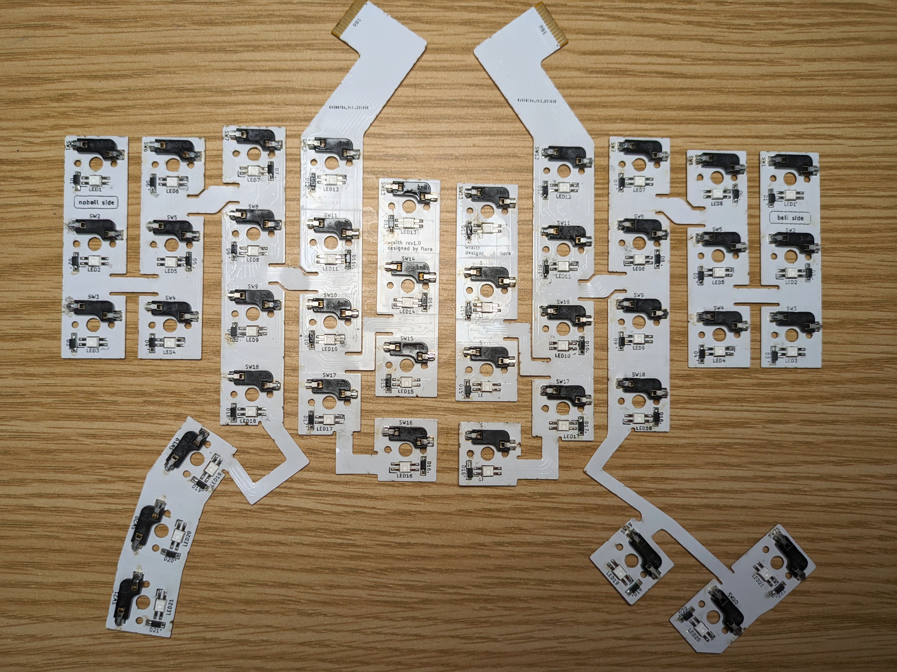
## トラックボール用PCBの実装
トラックボール用PCB、光学センサー、レンズを用意してください。最初センサーとレンズが組み合わさっている場合はこれを分けてください。センサーからレンズを取り外すときレンズのピンが曲がりやすいので注意してください。
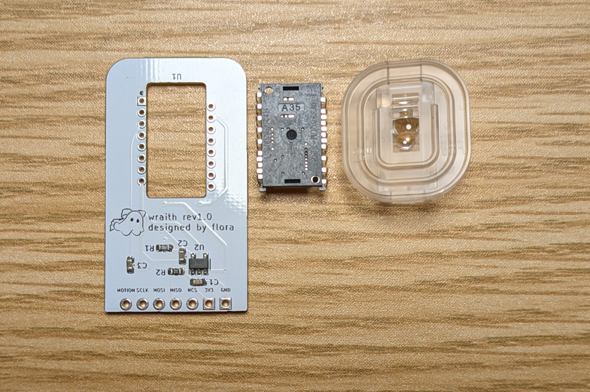
トラックボール用の基盤にはすでに一部の部品が実装されています。自分で実装する必要があるのは2箇所になります。
### PMW3360(光学センサー)の実装
トラックボールの動作を検知するためのセンサーを実装します。センサーには向きがあります。以下の画像を参照して、センサーをトラックボール用PCBに正しい向きで乗せてください。センサーの小さなくぼみとシルク印刷のドットをあわせます。

正しい向きで配置したらすべてのpinをはんだ付けします。
 
次にレンズを取り付けていきます。まずセンサーに保護シールが2枚貼ってあるのでピンセットなどで剥がします。
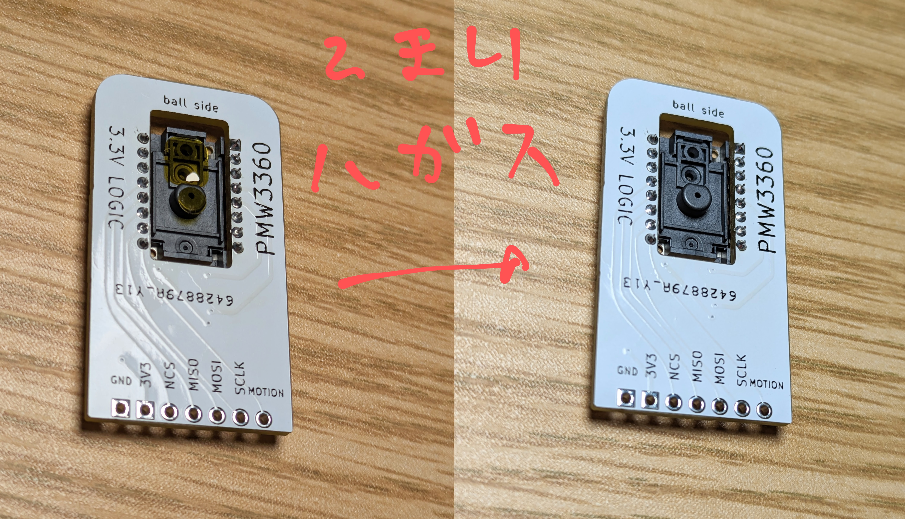
保護シールを剥がしたらレンズを取り付けます。レンズには向きがあります。画像を確認して正しい向きで装着してください。ball sideというシルク印刷がある方に、プリズムのような突起が来る向きになります。
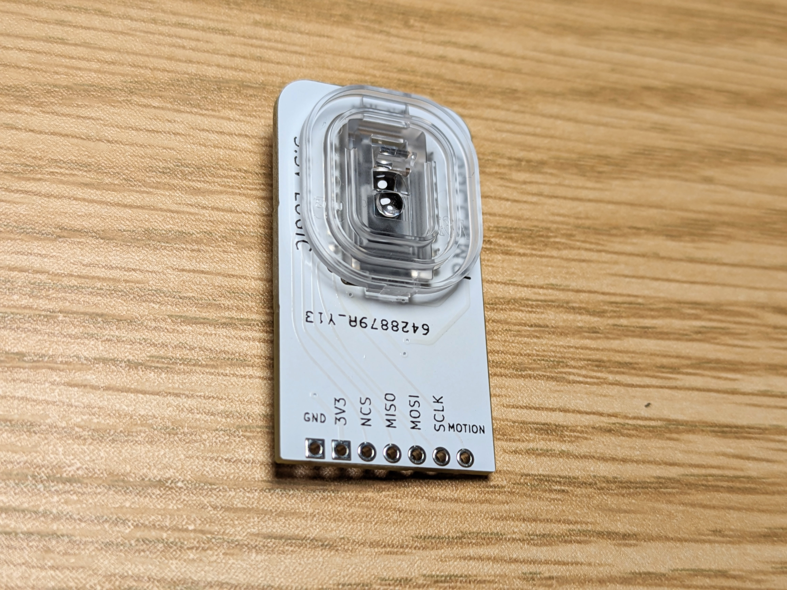

### ピンヘッダ(7pin)の実装
メインPCBと接続するためのピンヘッダをはんだ付けします。
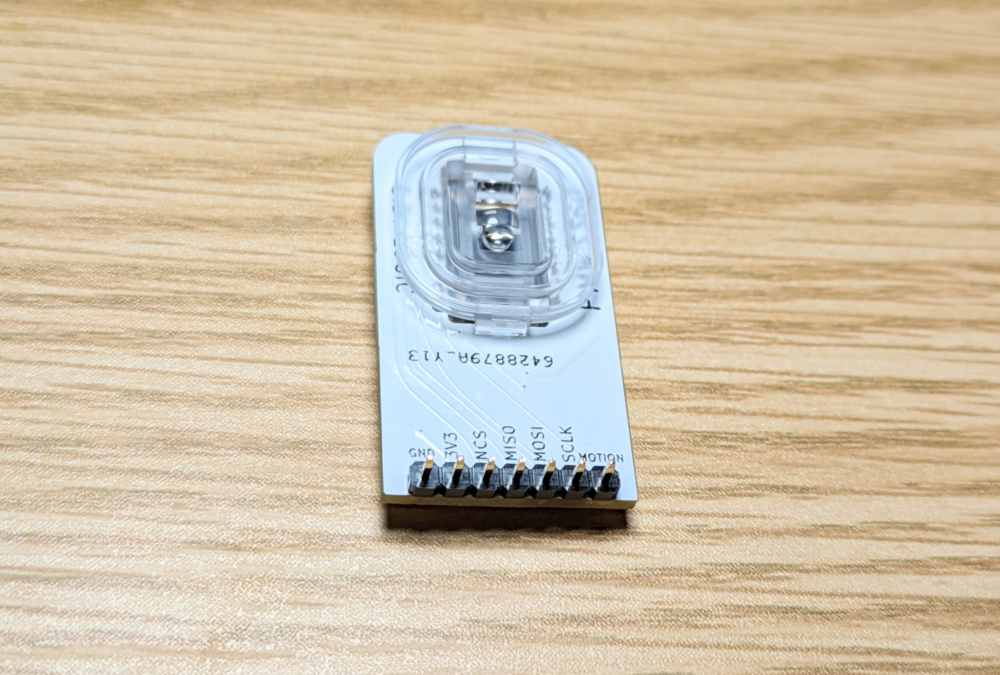
ピンヘッダはレンズ側から差し込んでください。差し込んだら裏側からはんだ付けしていきます。ただし、**ピンヘッダが斜めにならないように、1つのpinだけはんだ付けして、斜めったり浮いたりしていないことを確認してからすべてのpinをはんだ付けする**、という工程を必ず踏んでください。
 
ピンヘッダのはんだ付けが終わればトラックボール用PCBの実装は終わりです。

## 動作確認
キーボードが組み上がるとはんだ付けミスの修正が難しいので、この段階で動作確認を行います。

## 3Dプリントモデルの加工

### インサートナットの熱圧入

### セラミックボールの固定

## キーボードの組み立て
### CherryMX互換キースイッチの取り付け

## Raspberry Pi Picoにfirmwareをインストールする

## 部品の詳細
工事中。
## flexible PCBのシルク印刷

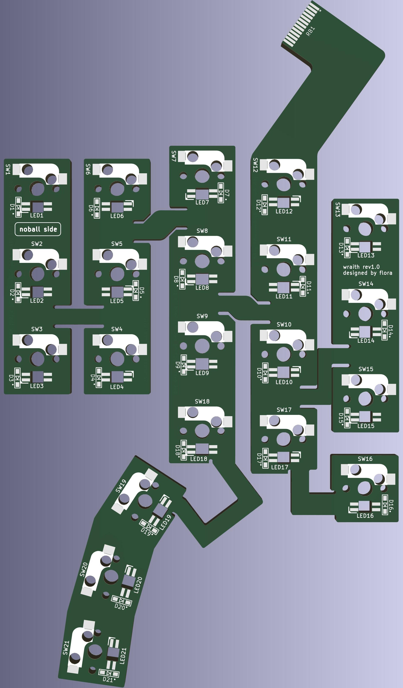
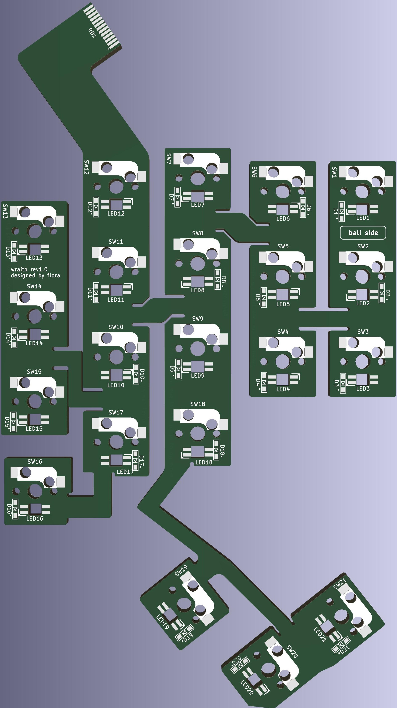

